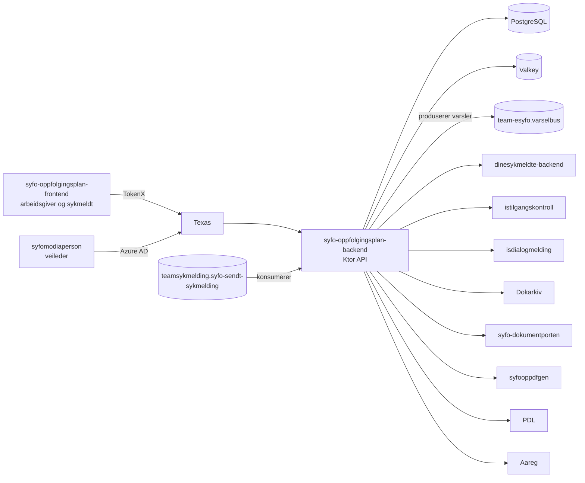

# Oppfølgingsplan-backend

[](https://github.com/navikt/syfo-oppfolgingsplan-backend/actions/workflows/build-and-deploy.yaml)


Backend-tjeneste for oppfølgingsplaner i sykefraværsoppfølgingen.

Tjenesten brukes av:

- **arbeidsgiver og nærmeste leder** som oppretter, lagrer og deler oppfølgingsplaner
- **sykmeldt** som henter egne planer
- **veileder i Nav** som kan hente delte planer i `syfomodiaperson`

Planene gjelder samarbeid mellom sykmeldt og arbeidsgiver eller nærmeste leder. Når en plan deles med Nav, kan veileder hente den.

## Oversikt



## Arkitektur og integrasjoner

Applikasjonen er en Kotlin- og Ktor-tjeneste som starter Netty på port 8080. Den setter opp avhengigheter, bakgrunnsoppgaver, routing og lifecycle hooks i `App.kt`.

Den viktigste flyten er:

- henter sykmeldt- og lederdata fra `dinesykmeldte-backend`
- lagrer oppfølgingsplaner og utkast i PostgreSQL
- bruker Valkey som cache
- genererer PDF via `syfooppdfgen`
- sender plan til lege via `isdialogmelding`
- arkiverer plan delt med Nav via Dokarkiv
- sender dokumenter videre via `syfo-dokumentporten`
- bruker PDL og Aareg som oppslag

### Bakgrunnsoppgaver

- `SendOppfolgingsplanTask` sender klare planer videre til Dokumentporten
- `CleanupUtkastTask` hard-sletter utkast eldre enn 4 måneder
- `SykmeldingsperiodeConsumer` lagrer relevante sykmeldingsperioder og håndterer tombstones

## API-oversikt

For domene-API-et er listen under et utvalg av sentrale endepunkter, ikke en fullstendig kontrakt.

### Arbeidsgiver

Base path: `/api/v1/arbeidsgiver/{narmesteLederId}/oppfolgingsplaner`

- **POST** `/` oppretter oppfølgingsplan
- **GET** `/oversikt` henter oversikt over planer for sykmeldt
- **GET** `/aktiv-plan` henter aktiv plan
- **GET** `/{uuid}` henter én plan
- **POST** `/{uuid}/del-med-lege` deler plan med lege
- **POST** `/{uuid}/del-med-veileder` deler plan med Nav
- **GET** `/{uuid}/pdf` henter PDF

Utkast ligger under `/api/v1/arbeidsgiver/{narmesteLederId}/oppfolgingsplaner/utkast`:

- **PUT** `/` lagrer utkast
- **GET** `/` henter utkast
- **DELETE** `/` sletter utkast

### Sykmeldt

Base path: `/api/v1/sykmeldt/oppfolgingsplaner`

- **GET** `/oversikt` henter oversikt over egne planer
- **GET** `/{uuid}` henter én plan
- **GET** `/{uuid}/pdf` henter PDF

### Veileder

Base path: `/api/v1/veileder/oppfolgingsplaner`

- **POST** `/query` henter planer for en sykmeldt
- **GET** `/{uuid}` henter PDF for plan som er delt med Nav

Veiledertilgang sjekkes mot `istilgangskontroll`.

## Kafka

Tjenesten bruker Kafka i begge retninger:

- **konsumerer** `teamsykmelding.syfo-sendt-sykmelding` med consumer group `syfo-oppfolgingsplan-backend-sykmeldingsperiode-v2`
- **produserer** varsler til `team-esyfo.varselbus` når en oppfølgingsplan opprettes

## Database og cache

- PostgreSQL kjøres i NAIS GCP SQL med Flyway-migreringer
- Valkey brukes med readwrite-tilgang i både dev og prod

## Autentisering og klienter

Innkommende kall er låst ned med `accessPolicy` i NAIS og sjekkes også i applikasjonen.

- `syfo-oppfolgingsplan-frontend` kaller arbeidsgiver- og sykmeldt-API med TokenX (ID-porten)
- `syfomodiaperson` kaller veileder-API med Azure AD
- Texas brukes til token introspeksjon og token exchange
- i dev er også `tokenx-token-generator` og `azure-token-generator` tillatt inn mot appen

Utgående kall går blant annet til `syfo-dokumentporten`, `syfooppdfgen`, `dinesykmeldte-backend`, `isdialogmelding`, `istilgangskontroll`, Dokarkiv, PDL og Aareg. Disse er åpnet i NAIS-manifestene.

## Miljøer og Swagger

- **dev:** https://syfo-oppfolgingsplan-backend.intern.dev.nav.no
- **prod:** https://syfo-oppfolgingsplan-backend.intern.nav.no

Swagger er tilgjengelig lokalt og i dev, men ikke i prod. Applikasjonen eksponerer Swagger bare når `!isProdEnv()`.

### Swagger lokalt

- **Arbeidsgiver:** http://localhost:8080/swagger/arbeidsgiver
- **Sykmeldt:** http://localhost:8080/swagger/sykmeldt
- **Veileder:** http://localhost:8080/swagger/veileder

### Swagger i dev

- **Arbeidsgiver:** https://syfo-oppfolgingsplan-backend.intern.dev.nav.no/swagger/arbeidsgiver
- **Sykmeldt:** https://syfo-oppfolgingsplan-backend.intern.dev.nav.no/swagger/sykmeldt
- **Veileder:** https://syfo-oppfolgingsplan-backend.intern.dev.nav.no/swagger/veileder

OpenAPI-filene ligger i `src/main/resources/openapi/`.

## Lokal infrastruktur

Lokal infrastruktur består av Postgres, Valkey, mock-oauth2-server, Texas og Kafka-oppsett.

Bruk `mise run docker-up` for å starte tjenestene og `mise run docker-down` for å stoppe dem. Kjør `mise tasks` for å se flere oppgaver.

For å kjøre Kafka-lokalt trenger containerplattformen ofte litt ekstra ressurser. For Colima kan dette være et greit utgangspunkt:

```bash
colima start --arch aarch64 --memory 8 --cpu 4
```

- Kafka UI: http://localhost:9080
- Lokal PDF-generator: klon [syfooppdfgen](https://github.com/navikt/syfooppdfgen) og følg instruksjonene der
- HTTP request-filer: ferdige forespørsler for IntelliJ HTTP Client i [`src/test/http`](src/test/http/README.md)
- Lokal tokenhenting: `fetch-token-for-local-dev.sh` henter et lokalt testtoken via fake ID-porten og Texas

## Autentisering i dev

Token for sykmeldt eller nærmeste leder:

https://tokenx-token-generator.intern.dev.nav.no/api/obo?aud=dev-gcp:team-esyfo:syfo-oppfolgingsplan-backend

Token for veileder:

https://azure-token-generator.intern.dev.nav.no/api/obo?aud=dev-gcp:team-esyfo:syfo-oppfolgingsplan-backend

Azure-token-generatoren krever veileder-bruker fra Ida.

## Fjern-debugging i NAIS

Det er mulig å aktivere fjern-debugging i NAIS. Generell beskrivelse finnes i [`utvikling`](https://github.com/navikt/utvikling/blob/main/docs/teknisk/Remote_debug_i_Intellij.md).

I `nais/nais-dev.yaml` kan du legge til `JAVA_TOOL_OPTIONS` under `env`:

```yaml
- name: JAVA_TOOL_OPTIONS
  value: -agentlib:jdwp=transport=dt_socket,server=y,suspend=n,address=*:5005
```

Du kan også gjøre liveness-proben mer tilgivende under debugging:

```yaml
liveness:
  path: /internal/is_alive
  initialDelay: 10
  timeout: 5
  periodSeconds: 60
  failureThreshold: 10
```

Opprett tunnel til port 5005:

```bash
kubectx dev-gcp
kubectl port-forward deployment/syfo-oppfolgingsplan-backend -n team-esyfo 5005:5005
```

## Utvikling

Bruk `mise tasks` for å se oppdaterte oppgaver for bygg, test, lokal infrastruktur og andre hjelpemidler.

Swagger, HTTP request-filer og tokenhjelpere gjør det enklere å teste API-et manuelt.

## For Nav-ansatte

Spørsmål om tjenesten kan tas i [#esyfo på Slack](https://nav-it.slack.com/archives/C012X796B4L).
